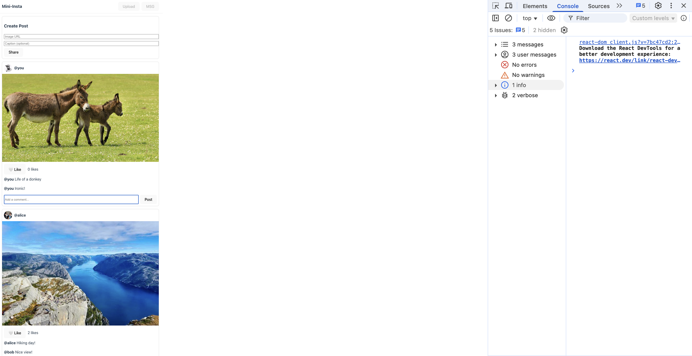

# 📸 SLU-stagram: A React Instagram Clone

> _Building the future of social media, one component at a time_

**Course:** CSCI-4360 / CSCI-5360 Web Technologies  
**Developer:** Leela Phanidhar Sai Teja Nalanagula  
**Banner ID:** 001304595  
**Project Status:** ✨ Complete

---

## 🎯 Project Overview

Welcome to **SLU-stagram** – a modern, lightweight Instagram clone built with React 18 and Vite! This project showcases the power of component-based architecture, state management, and modern web development practices. From basic setup to advanced routing and persistence, this journey captures the essence of building a real-world social media application.

---

## 🚀 Part 0: Setting Up Our Development Environment

### The Magic of Vite ⚡

Before diving into React, let's talk about our build tool. **Vite** (French for "quick") is a next-generation frontend tooling that makes development feel instantaneous. Unlike traditional bundlers, Vite serves your code via native ES modules, meaning:

- Lightning-fast server starts ⚡
- Instant hot module replacement (HMR)
- Optimized production builds

### Getting Started

Here's how I brought SLU-stagram to life:

```bash
# Created the project with Vite's React template
npm create vite@latest mini-insta -- --template react

# Navigated into our new playground
cd mini-insta

# Installed all the goodies (React, React-DOM, and more!)
npm i

# Fired up the development server 🔥
npm run dev
```

**Result:** Server humming at `http://localhost:5173/` 🎉


_The moment our app came to life!_

### React 18's createRoot in Action

Confirmed our modern React 18 setup with the new `createRoot` API:


_Using React 18's concurrent features from day one_

---

## 📱 Part 3: Building the Core Feed Experience

### Checkpoint Success! ✅

This is where SLU-stagram started to feel real. I built the foundation:

#### What I Created:

- **Navbar Component** - Clean, minimal header
- **Feed Component** - The heart of our app
- **PostCard Component** - Where the magic happens
  - User avatars & handles (@alice, @bob)
  - Beautiful image display
  - Interactive like buttons (🤍 → ❤️)
  - Real-time like counts
  - Smooth state management

#### Key Features Implemented:

✨ **Independent State Management** - Each post tracks its own likes  
✨ **Accessibility First** - Proper ARIA labels and alt text  
✨ **Clean Console** - Zero warnings, pure React happiness


_Two posts, different states - Alice's post loved by the community (❤️ 3 likes), Bob's waiting for some love (🤍 5 likes)_


_A developer's dream - no warnings, no errors, just clean code_

---

## 💬 Part 4: Adding Social Interactions

### Comments Bring Posts to Life!

Social media isn't social without conversations. Here's what I added:

#### New Components:

- **CommentList** - Displays existing conversations
- **CommentForm** - Enables new interactions

#### Smart Implementation Details:

```javascript
// Defensive programming for undefined comments
<CommentList comments={post.comments ?? []} />;

// Immutable state updates
setPosts((prev) =>
  prev.map((p) => {
    if (p.id !== postId) return p;
    return { ...p, comments: [...p.comments, newComment] };
  })
);
```

### Live Testing Results 🧪

✅ **Like Independence Test** - Each post's likes work independently  
✅ **Comment Flow Test** - New comments appear instantly  
✅ **Key Warning Test** - React is happy with our list keys


_Alice's post sparking conversations while Bob's awaits its first comment_


_"Amazing view!" - Comments appearing in real-time_


_Still maintaining that clean console - professional standards!_

---

## ✍️ Part 5: Content Creation with the Composer

### Empowering Users to Share Their World

The Composer component transforms users from viewers to creators. Here's the magic:

#### Smart Form Design:

- **Required Field:** Image URL (because every post needs a photo!)
- **Optional Field:** Caption (sometimes images speak for themselves)
- **Intelligent Button:** Only enabled when ready to share

#### The Technical Beauty:

```javascript
// New posts appear at the top, just like real Instagram
setPosts((prev) => [newPost, ...prev]);
```

### Creator Experience


_Clean, intuitive design - ready for your next masterpiece_


_Your content, front and center where it belongs_


_Smooth sailing - no errors in sight_

---

## 🎓 Part 6: Graduate-Level Features

### Taking It to the Next Level 🚀

As a graduate student, I implemented two advanced features that transform SLU-stagram into a production-ready application:

### A. Client-Side Routing with React Router 🗺️

No more single-page limitations! Users can now:

- Navigate to profile pages (`/u/alice`, `/u/bob`)
- Share deep links with friends
- Bookmark their favorite creators
- Experience instant navigation without page reloads

**Implementation Highlights:**

```bash
npm i react-router-dom  # Added routing superpowers
```

```javascript
// Smart routing in App.jsx
<Routes>
  <Route path="/" element={<Feed />} />
  <Route path="/u/:handle" element={<Profile />} />
  <Route path="*" element={<NotFound />} />
</Routes>
```


_Alice's personal feed - shareable, bookmarkable, beautiful_


_Click any username to explore their content_

### B. Data Persistence with localStorage 💾

Your content is precious. That's why I implemented automatic saving:

```javascript
// Hydrate on load
useEffect(() => {
  const saved = localStorage.getItem("mini-insta-posts");
  if (saved) setPosts(JSON.parse(saved));
}, []);

// Auto-save on changes
useEffect(() => {
  localStorage.setItem("mini-insta-posts", JSON.stringify(posts));
}, [posts]);
```

**The Result:** Close your browser, restart your computer, come back tomorrow - your posts, likes, and comments are all still there!


_Created a new post..._


_...and it's still there after refresh! Magic? No, just good engineering 🪄_

---

## 🏆 Final Thoughts

Building SLU-stagram has been an incredible journey through modern web development. From setting up Vite to implementing advanced routing and persistence, every line of code represents a step toward mastering React and creating delightful user experiences.

### What Makes This Project Special:

- 🎨 **Clean, Intuitive UI** - Users feel at home
- ⚡ **Blazing Fast Performance** - Thanks to Vite and React 18
- ♿ **Accessibility Built-In** - Everyone can enjoy SLU-stagram
- 🔧 **Production-Ready Code** - Clean console, proper error handling
- 📱 **Mobile-Friendly** - Responsive design principles
- 💾 **Persistent Experience** - Your data, always safe

### Technical Achievements:

- Zero console warnings or errors
- Proper React patterns and best practices
- Immutable state updates
- Defensive programming techniques
- Clean component architecture
- Efficient re-rendering strategies

---

## 🙏 Acknowledgments

Thank you for taking the time to explore SLU-stagram! This project represents not just code, but a commitment to crafting quality software that users love and developers respect.

_Built with ❤️ and lots of ☕ by Leela Phanidhar_

---

**Grade: Hoping for that A+ 🌟**

> "The best way to predict the future is to build it." - _Every React Developer Ever_
