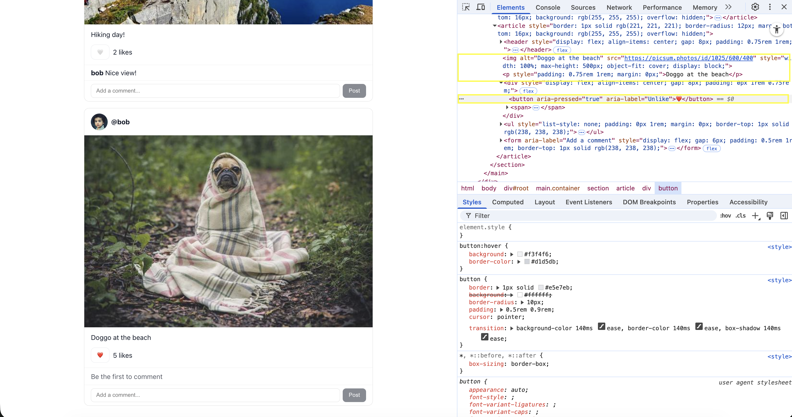

# SLU-stagram: A React Instagram Clone

**Course:** CSCI-4360 / CSCI-5360 Web Technologies  
**Developer:** Leela Phanidhar Sai Teja Nalanagula  
**Banner ID:** 001304595

---

## Deployment Details

The project is successfully deployed on **GitHub Pages** using Vite and `gh-pages`.

**Live Link:**  
[https://nlp-saiteja.github.io/mini-insta/](https://nlp-saiteja.github.io/mini-insta/)

This deployment uses **HashRouter** for client-side routing.  
Since GitHub Pages is a static host and does not support SPA rewrites, the hash (`#`) ensures routes work even after refreshing or sharing links.

### Accessing Views

| Page            | Link                                                                                                     | Description                      |
| --------------- | -------------------------------------------------------------------------------------------------------- | -------------------------------- |
| Home Feed       | [https://nlp-saiteja.github.io/mini-insta/#/](https://nlp-saiteja.github.io/mini-insta/#/)               | Displays all posts with Composer |
| Alice’s Profile | [https://nlp-saiteja.github.io/mini-insta/#/u/alice](https://nlp-saiteja.github.io/mini-insta/#/u/alice) | Shows only Alice’s posts         |
| Bob’s Profile   | [https://nlp-saiteja.github.io/mini-insta/#/u/bob](https://nlp-saiteja.github.io/mini-insta/#/u/bob)     | Shows only Bob’s posts           |

---

## Part 0: Project Setup

### Vite Setup

```bash
npm create vite@latest mini-insta -- --template react
cd mini-insta
npm i
npm run dev
```

**Result:** App running at `http://localhost:5173/`


**React 18 setup verification:**


---

## Part 3: Feed and PostCard Components

### Features Implemented

- Navbar and Feed displaying PostCards.
- Each PostCard includes author handle, avatar, image, caption, and like functionality.
- Independent like state per post.
- Accessibility maintained with alt text and ARIA attributes.


---

## Part 4: Comment Functionality

### Features Implemented

- Added **CommentList** and **CommentForm** components.
- Users can add new comments that appear instantly.
- No React key warnings.

**State update pattern:**

```javascript
setPosts((prev) =>
  prev.map((p) => {
    if (p.id !== postId) return p;
    return { ...p, comments: [...p.comments, newComment] };
  })
);
```

**Verification:** Comments appear immediately and persist.


---

## Part 5: Composer Component

### Features Implemented

- Form for users to add new posts.
- Validates Image URL; Caption optional.
- Button disabled when URL invalid.
- New post prepends to the feed.

**Key logic:**

```javascript
setPosts((prev) => [newPost, ...prev]);
```

**Verification:** New post appears at top; console clean.


---

## Part 6: Routing and Persistence

### A. Routing with React Router

- Implemented `/u/:handle` route for profile views.
- Links redirect to profile pages dynamically.
- Implemented `Profile` component filtering feed by author.

**Verification:** Clicking author name shows only their posts.


### B. Persistence with Local Storage

- Posts, likes, and comments persist through refresh.
- Data is saved automatically on every change.

**Key logic:**

```javascript
useEffect(() => {
  localStorage.setItem("mini-insta-posts", JSON.stringify(posts));
}, [posts]);
```


---

## Polish (5 pts): Styling & Accessibility

### 1. Light Styling in `index.css`

**Implemented:**

- System font stack applied to body.
- `.container` class centered layout (max-width ≤ 720px).
- Button hover and focus-visible outlines added.

**Verification:**  
DevTools confirms font-family includes `system-ui`, container centered, and hover styles visible.

### 2. Keyboard Accessibility

**Implemented:**

- Composer as real form with `Enter` submission.
- Like button uses `aria-pressed` and `aria-label` for toggling.

**Verification:**  
Pressing Enter submits valid form. `aria-pressed` toggles in DevTools.

### 3. Alt Texts

**Implemented:**

- Avatars have `{author} avatar` alt text.
- Posts use caption or fallback `"Photo by @author"`.

**Verification:**  
DevTools shows meaningful alt text on all images.

**Screenshots:**




---

## Component Tree


---

## Summary

All parts of **SLU-stagram** were implemented according to the rubric.  
The application includes working routing, persistence, accessibility, and responsive styling.  
Deployment verified and live at:  
[https://nlp-saiteja.github.io/mini-insta/](https://nlp-saiteja.github.io/mini-insta/)
